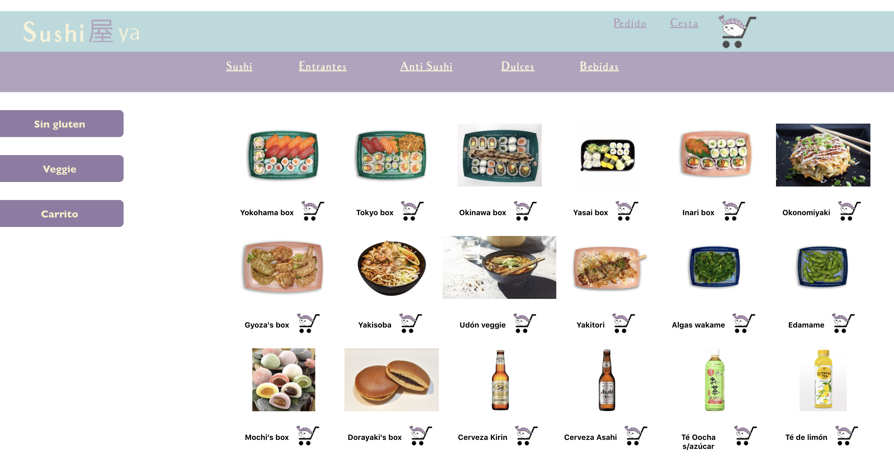

# SushiYa
SushiYa es un Ecommerce creado con MERN Stack(MongoDb, Express,React,NodeJS) + SQL. En el backend hemos utilizado 2 tecnologías: SQL para la bbdd de los productos y MongoDB(mongoose) para los datos de usuarios y el guardado de los pedidos.

Sushiya es un eCommerce de comida japonesa a domicilio en el que puedes hacer pedidos, añadirlos al carrito y modificarlo.
Puedes registrarte y tener tu propia página de usuaurio

### Vista Principal

 

### Vista de los posibles pedidos

 

### Vista de la página de error

